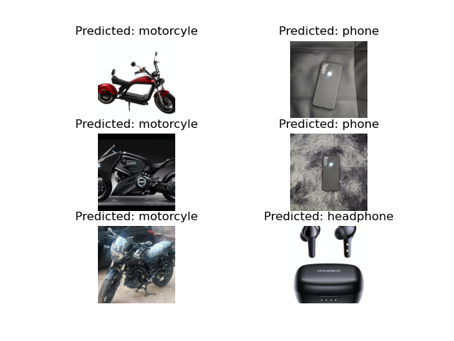

# training_image_classification_pytoch

For training:

``` python train_resnet_on_custom_data_pytorch.py --operation train ```


For testing:

```python train_resnet_on_custom_data_pytorch.py --operation test ```

```
data--
    -train
          - glasses
          - watch
          - water_can
          - notebook
    -test
          - glasses
          - watch
          - water_can
          - notebook
```
          
Result samples:


